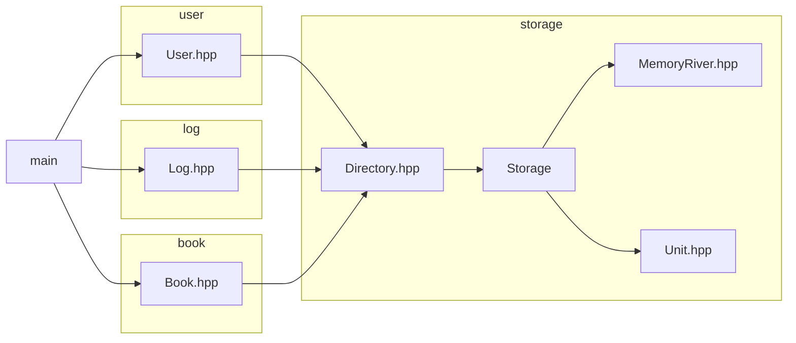

# 项目：Bookstore
作者：张成宇  
## 程序功能概述
  实现了一个书店管理系统，实现图书库存信息管理，用户信息管理，销售信息管理，日志记录打印功能。  

|   系统    |                      功能                      |
|:-------:|:--------------------------------------------:|
| 图书库存系统  |        图书进货 图书信息修改 图书购买 图书查询        |
|日志管理系统| 查询指定笔数交易情况 打印员工工作报告 打印财务记录报告 打印总体日志 |
|用户管理系统|       创建用户 修改用户信息 登录/登出 删除用户        |

## 主体逻辑说明

## 代码文件结构
