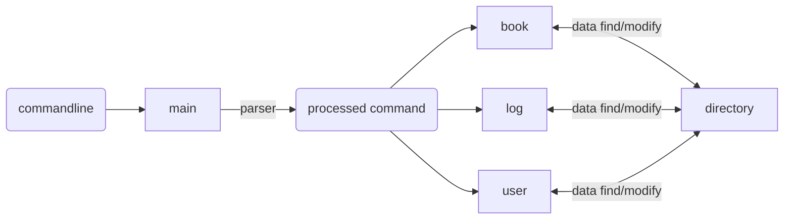
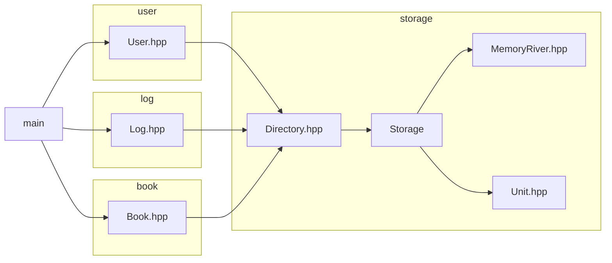
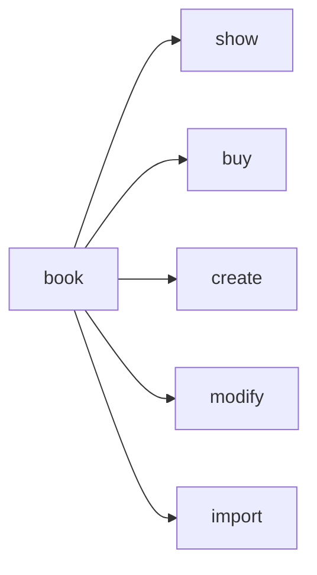
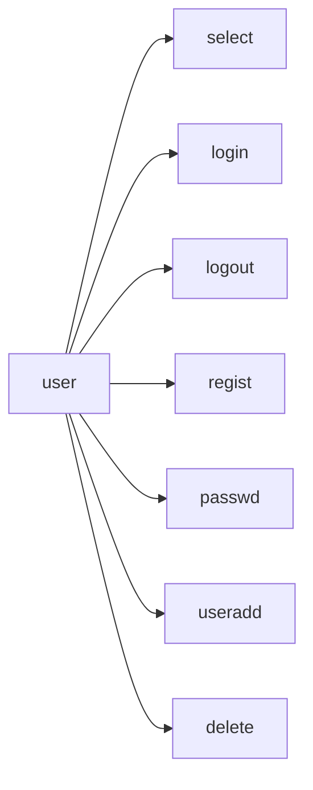
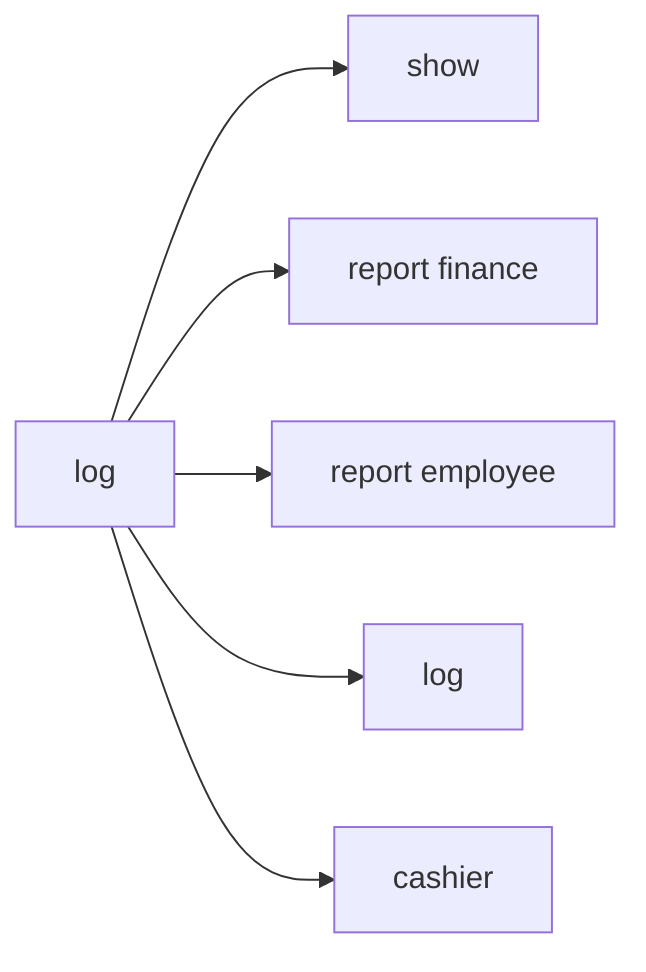
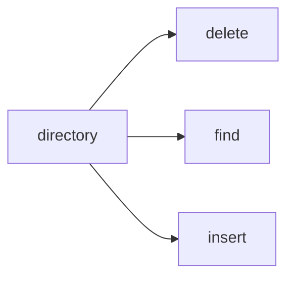

# 项目：Bookstore
作者：张成宇  
## 程序功能概述
  实现了一个书店管理系统，实现图书库存信息管理，用户信息管理，销售信息管理，日志记录打印功能。  

|   系统    |                      功能                      |
|:-------:|:--------------------------------------------:|
| 图书库存系统  |        图书进货 图书信息修改 图书购买 图书查询        |
|日志管理系统| 查询指定笔数交易情况 打印员工工作报告 打印财务记录报告 打印总体日志 |
|用户管理系统|       创建用户 修改用户信息 登录/登出 删除用户        |

## 主体逻辑说明

 
## 代码文件结构

## 功能设计
- book模块 处理和book相关的内容

- user模块 处理和user信息相关的内容并维护登录栈

- log模块 日志记录并计算盈亏

- directory模块 维护一个键-值对数据存储类

## 数据库设计
以下数据均以键-值形式存储

|  index   |                    value                     |
|:--------:|:--------------------------------------------:|
|   ISBN   |                  book_info                   |
| bookname | book_info |
|  author  |       book_info        |
| keyword | book_info|
|user_id| user_info|

日志信息和盈亏信息直接整体存储于外存中，在调用时统一读入内存。

## 类、结构体设计
- struct book_info
  - ISBN
  - bookname
  - author
  - keyword
  - price
  - quantity
  - 比较方式: ISBN 字典序
- struct user_info
  - user_id
  - username 
  - password
  - privilege
  - 比较方式: user_id 字典序
- struct Unit
  - index
  - value
  - 比较方式: 先index后value
- template class MemoryRiver 实现外存读写
- class Directory 封装文件存储
- class Log 封装 log 系统
- class User 封装 user 系统
- class Directory 封装 directory 系统