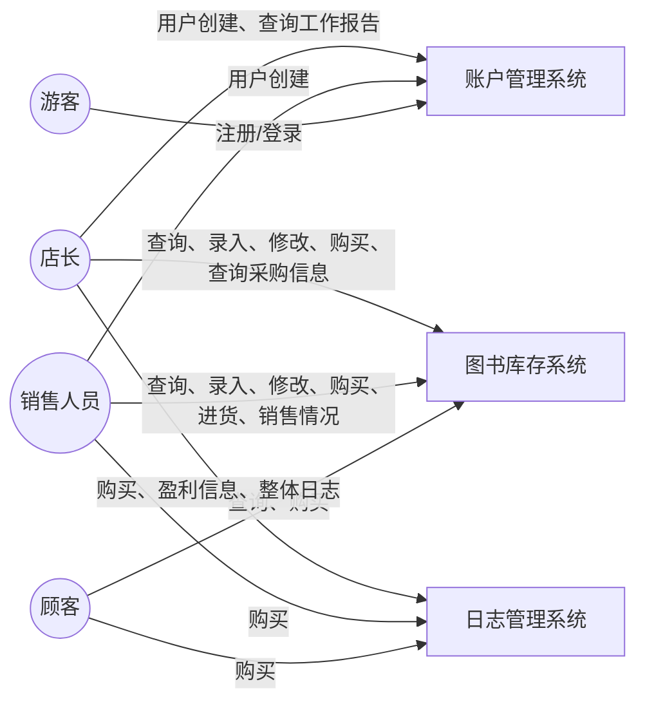
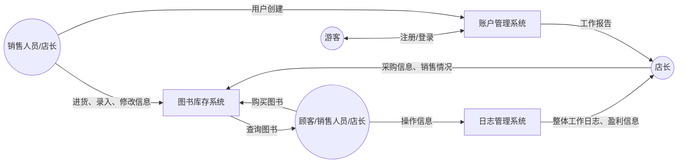

# 需求分析
- 业务流图

- 数据流图

- 数据词典
  - 图书信息
    - ISBN 号（20 个字符）
    - 书名（60 个字符）
    - 作者（60 个字符）
    - 关键字（可以有多个，总共不超过 60 个字符）
    - 库存量（整型）
    - 单价（非负实数）
  - 用户信息
    - 用户名 
    - ...
  - 销售日志
    - 图书 ISBN 号
    - 数量
    - 单价
  - 工作情况报告
    - 用户系统操作类型
    - 用户信息
  - 采购信息
    - 图书 ISBN 号
    - 数量
    - 单价 
  - 整体工作日志  

- 功能说明  
  - 图书库存系统
    - 功能1 图书信息录入
      - 输入 图书信息
      - 操作 添加对应图书信息
    - 功能2 图书信息修改
      - 输入 修改对象 修改内容
      - 操作 修改对应图书信息
    - 功能3 图书采购
      - 输入 采购图书信息 采购数量
      - 操作 增加对应库存
    - 功能4 图书购买
      - 输入 购买图书信息 购买数量
      - 操作 减少对应库存
    - 功能5 图书查询
      - 输入 部分图书信息
      - 输出 完整图书信息
    - 功能6 查询采购信息
      -输出 采购图书信息
    - 功能7 查询销售情况
      -输出 查询销售信息
  - 日志管理系统
    - 功能1 收入
      - 输入 收入
    - 功能2 支出
      - 输入 支出
    - 功能3 查询盈利信息
      - 输出 收入、支出、利润情况
    - 功能4 写入日志
      - 输入 整条指令
      - 操作 记录
    - 功能5 查询整体日志
      - 输出 整体日志
  - 用户管理系统
    - 功能1 创建用户
      - 输入 用户信息
      - 操作 记录用户信息
    - 功能2 登录
      - 输入 用户信息
      - 操作 登录
    - 功能3 查看工作情况报告
      -输出 操作类型 对象

- 用户交互设计
  - 录入图书 insert_book
    - 返回 成功/失败
  - 购买图书 buy_book
    - 返回 成功/失败
  - 查询图书 search_book
    - 返回 图书信息/失败
  - 修改图书信息 modify_book
    - 返回 成功/失败
  - 进货 import_book
    - 返回 成功/失败
  - 创建用户 insert_user
    - 返回 成功/失败
  - 登录 login
    - 返回 成功/失败
  - 修改用户信息 modify_user
    - 返回 成功/失败
  - 查询采购情况 import_log
    - 返回 采购图书 数量 单价
  - 查询销售情况 sales_log
    - 返回 销售图书 数量 单价
  - 查询盈利信息 finance_log
    - 返回 收入 支出 利润
  - 查询工作报告 user_log
    - 返回 操作内容 操作对象
  - 查询整体报告 overall_log
    - 返回 整条日志

